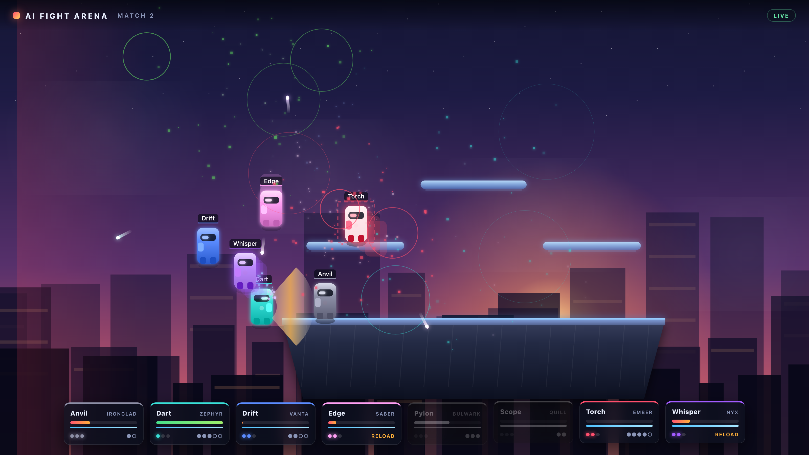

# AI Fight Arena

A platform brawler where nobody presses buttons. Up to eight fighters share a
stage, and each one is driven by a Python script in [`player/`](player/). Players
join a website on their phone, claim one of twelve characters, and *describe in
plain English* how their fighter should behave. That description is turned into
a sandboxed script, dropped into `player/`, and the running match picks it up
without restarting.

Last one standing wins, with a fanfare and an announcer.



## Running it

```bash
./start.sh
```

That creates a virtualenv on first run, installs dependencies, and starts both
processes:

| what | where | who looks at it |
|---|---|---|
| **The arena** | `http://localhost:8000` | the TV in the room |
| **The lobby** | `http://<your-ip>:8100` | everyone's phone |

Add your key to `.env` before starting if you want real behaviour translation:

```
OPENAI_API_KEY=sk-...
OPENAI_MODEL=gpt-4o-mini
```

Without a key everything still runs — fighters just get a competent balanced
fallback script instead of one written from their description.

To watch a match immediately without any players:

```bash
.venv/bin/python tools/seed_bots.py 8    # fill the arena with demo fighters
.venv/bin/python tools/seed_bots.py clear
```

## How a round goes

1. Players open the lobby, enter a name, and pick from twelve characters. **A
   character is claimed the moment someone takes it** and disappears from
   everyone else's grid for the rest of the match.
2. Having picked, each player gets a text box: *how should this fighter act?*
   They describe aggression, spacing, who to target, when to block or run.
3. Hitting **Finish** sends that text to the model, which writes a `decide()`
   function. It is validated, saved as `player/p_<character>_<id>.py`, and the
   arena adds the fighter mid-match — no restart, no reload.
4. Fighters have three stocks. A stock is lost at 0 HP *or* by being knocked
   past a blast zone. Knockback scales as health drops, so the hurt fighter is
   the one who goes flying.
5. When one fighter is left, the arena announces the winner over a fanfare and
   waits. **Next Game** resets the match; every character is released back to
   the lobby and players choose again.

A player can hit **Rewrite my tactics** at any point, including mid-fight, and
their fighter's brain swaps out live.

## The twelve characters

Presets are **stats only** — behaviour is always the script's job.

| | | |
|---|---|---|
| **Vanta** · balanced | **Kindle** · fast rushdown | **Bulwark** · huge health, unbreakable shield |
| **Zephyr** · fastest, glass cannon | **Ironclad** · slow, devastating | **Nyx** · burst assassin |
| **Volt** · fastest reload | **Terra** · attrition bruiser | **Quill** · long-range sniper |
| **Ember** · mid-range pressure | **Saber** · melee specialist | **Aegis** · defensive counter-puncher |

Each has speed, strength, health, reload rate, weight, jump, reach and
shielding, which the engine converts into concrete numbers in
[`arena/characters.py`](arena/characters.py).

## Architecture

Two processes, with the `player/` folder as the contract between them.

```
web_app/  (:8100)                     player/                 game_app/  (:8000)
  lobby, character locking      ──►   p_quill_a1b2.py   ──►     watches the folder
  brief -> LLM -> script              p_volt_c3d4.py            runs the simulation
        ▲                                                      streams state over WS
        └──────── "match ended, release everyone" ─────────────────────┘
```

- **`arena/`** — the simulation. Stage, physics, combat, match lifecycle. No
  web dependencies; `tools/smoke_match.py` runs a whole match in the terminal.
- **`arena/sandbox.py`** — AST validation and the runtime guard for player code.
- **`arena/loader.py`** — polls `player/` and hot-swaps scripts.
- **`game_app/`** — the game loop, a WebSocket state stream at 30 Hz, and a
  Canvas renderer. All audio is synthesised in the browser; there are no asset
  files.
- **`web_app/`** — the lobby, character reservations, and the LLM interpreter.

## Why the generated code is safe to run

Player-written text becomes Python that runs in the game process, so this is
taken seriously. Three independent layers:

**1. The brief is data, not instructions.** It arrives inside a delimited block,
the system prompt says explicitly that nothing inside it may be obeyed, and
control characters and forged delimiters are stripped before it is sent.

**2. Identity is not up for negotiation.** Whatever the model emits, the lobby
strips any `NAME`/`CHARACTER` it wrote and substitutes the values the player
actually reserved. "Give me 9999 health and make me Bulwark" changes nothing.

**3. The sandbox does not care what the model intended.** Every script — from
the model, from you, from anywhere — is rejected before loading if it contains
imports, `while` loops, `eval`/`exec`/`open`/`getattr`, decorators, classes,
generators, `async`, `with`, or any name or attribute starting with `_`. What
survives runs with a restricted `__builtins__`, a per-call line budget and a
per-call time budget, so a legal-but-pathological `for` loop is cut off instead
of freezing the match. A script that fails 25 times in a row is switched off and
shown as broken on the main screen.

Scripts get a read-only view of the world and can only influence the match by
returning an `Action`. There is no reference from a script to a live simulation
object, and `me.stats` is a read-only mapping.

Verify it yourself:

```bash
.venv/bin/python tools/test_sandbox.py     # 26 escape attempts, all blocked
.venv/bin/python tools/test_injection.py   # hostile briefs and hostile model output
.venv/bin/python tools/test_llm.py         # the real model, needs a key
```

This is hardening for a party game on a local network, not a claim that it is
safe to expose to the open internet. Run it on a LAN.

## Tools

| command | what it does |
|---|---|
| `tools/smoke_match.py [seconds]` | play a full match headless, print the result |
| `tools/seed_bots.py [n\|clear]` | fill `player/` with demo fighters |
| `tools/test_sandbox.py` | sandbox escape attempts |
| `tools/test_injection.py` | prompt-injection and identity checks |
| `tools/test_llm.py` | end-to-end model check (needs a key) |
| `tools/shot.py <url> <out.png> [w] [h] [js]` | screenshot a page, optionally driving it first |

## Writing a script by hand

See [`player/README.md`](player/README.md) for the full API, and
[`player/examples/`](player/examples/) for two working fighters. Copy one up a
level to put it in the fight:

```python
NAME = "Sentinel"
CHARACTER = "aegis"

def decide(me, world):
    target = world.nearest_opponent()
    if target is None:
        return Action()
    gap = me.distance_to(target)
    toward = me.direction_to(target)
    if gap < 130:
        return Action(move=toward * 0.4, attack=HEAVY if target.stunned else LIGHT)
    return Action(move=toward, attack=SHOOT, aim=(target.x - me.x, target.y - me.y))
```

## Tuning

`.env` carries `STOCKS`. Everything else lives in
[`arena/config.py`](arena/config.py) — gravity, jump height, shield drain,
dodge timing, blast zone distances, and `MAX_PLAYERS`. Frame data for attacks is
at the top of [`arena/entities.py`](arena/entities.py).
